# yo_quiz_app

A small project application in which the user can create private quizzes, share the code, add them to himself, delete them.

Table of Contents:
- [yo_quiz_app](#yo_quiz_app)
  - [Features](#features)
    - [Realized features](#realized-features)
    - [Unrealized other features](#unrealized-other-features)
  - [Screenshots](#screenshots)
  - [Configuration](#configuration)
    - [Configuration firebase](#configuration-firebase)
  - [Author](#author)
  - [License](#license)

## Features
### Realized features

Profile:
- [x] Show userProfile.
- [x] Upload and look user image.
- [x] Users tests: share, delete, edit, create.

Quiz create:
- [x] Create quiz: set title and description.
- [x] Create question: set text, answers.
- [x] Update quiz.
- [x] Update question.
- [x] Share quiz.

Quiz game:
- [x] Quiz main (description) screen.
- [x] Answer counter.
- [x] Screen question.
- [x] Screen results.

Home page:
- [x] Official tests in public screen. Set quiz public status only in firebase console.

Quiz create other:
- [x] Delete quiz.
- [x] Edit existed created quiz.
- [ ] Fix error A RenderFlex overflowed: when keyboard opened and navigator goes to create_questions_area_screen

### Unrealized other features 
Maybe i do it...

Quiz game:
- [ ] Previous result.
- [ ] Timer in question when user play game.

Other:
- [ ] Leaderboard.

Profile other:
- [ ] Contacts user.
- [ ] User scores.
- [ ] Shared tests.

## Screenshots

| Sign Up | Sign In | Home screen |
| - | - | - |
| 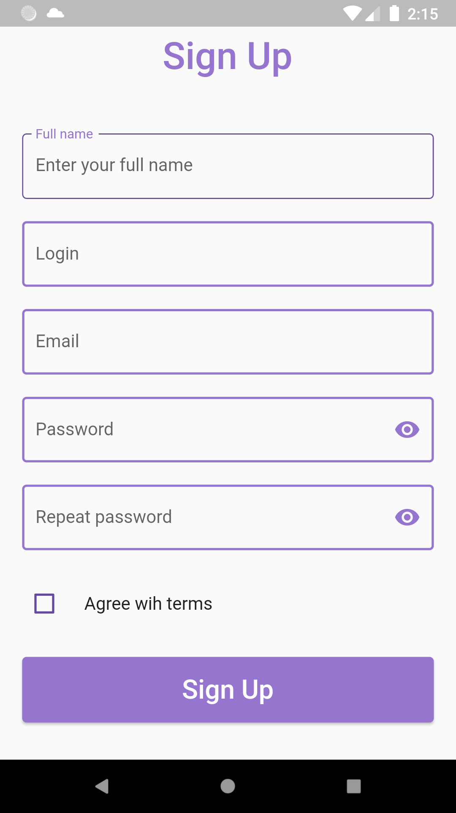 |  | 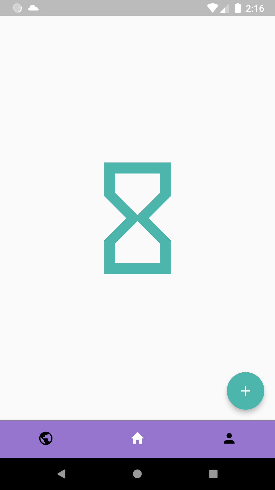 |

| Public quizzes screens | Profile | Created quizzes by user |
| - | - | - |
| 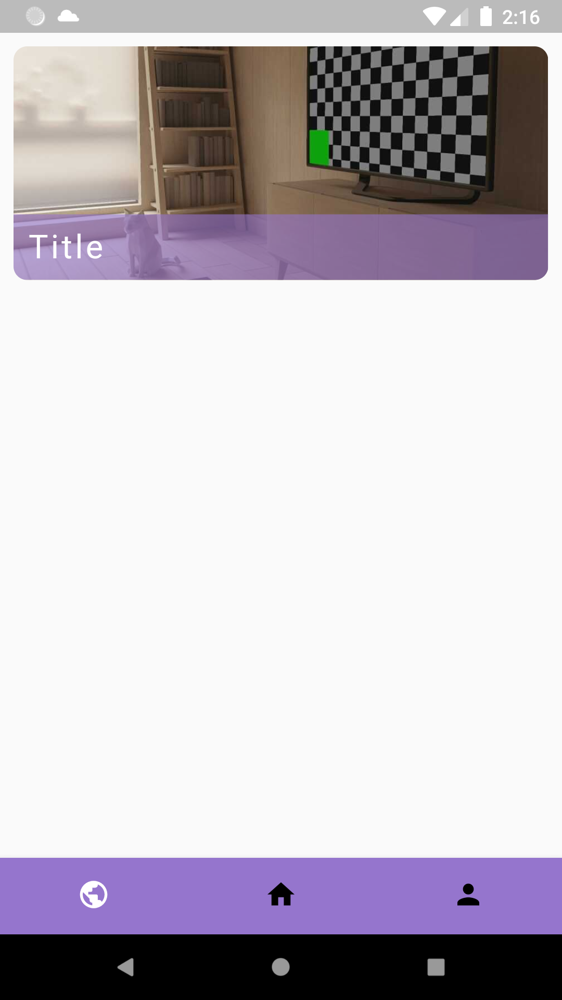 | 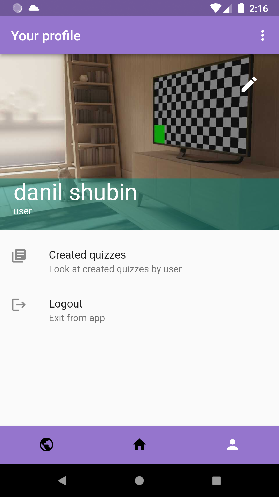 | 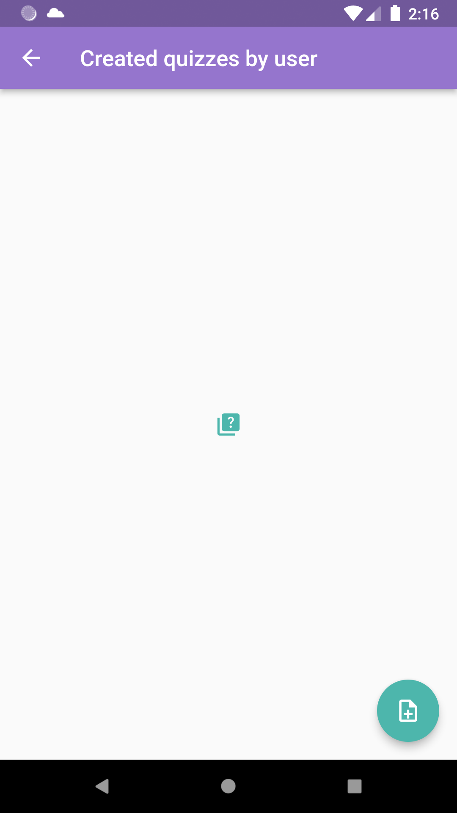 |

| Create quiz description screen | Create quiz description screen (indicator) | Created quizzes by user |
| - | - | - |
| 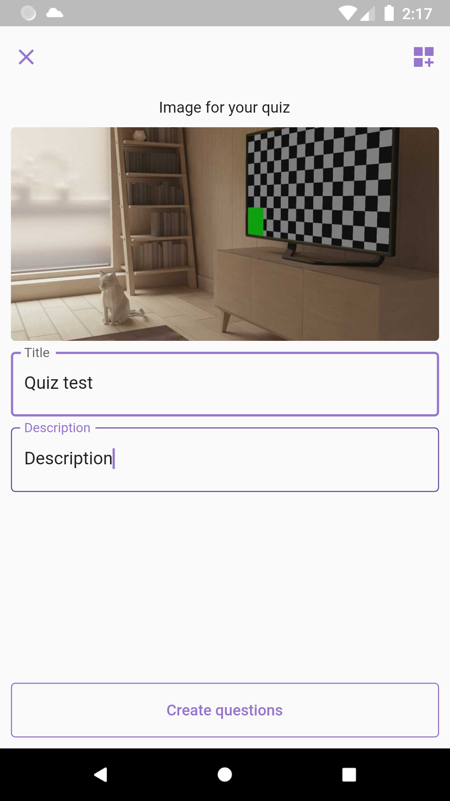 | 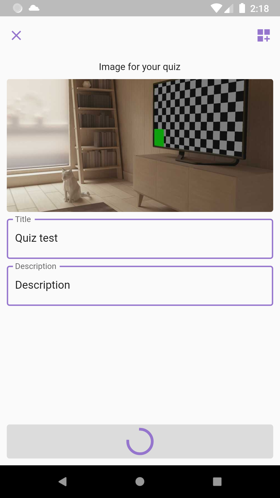 | 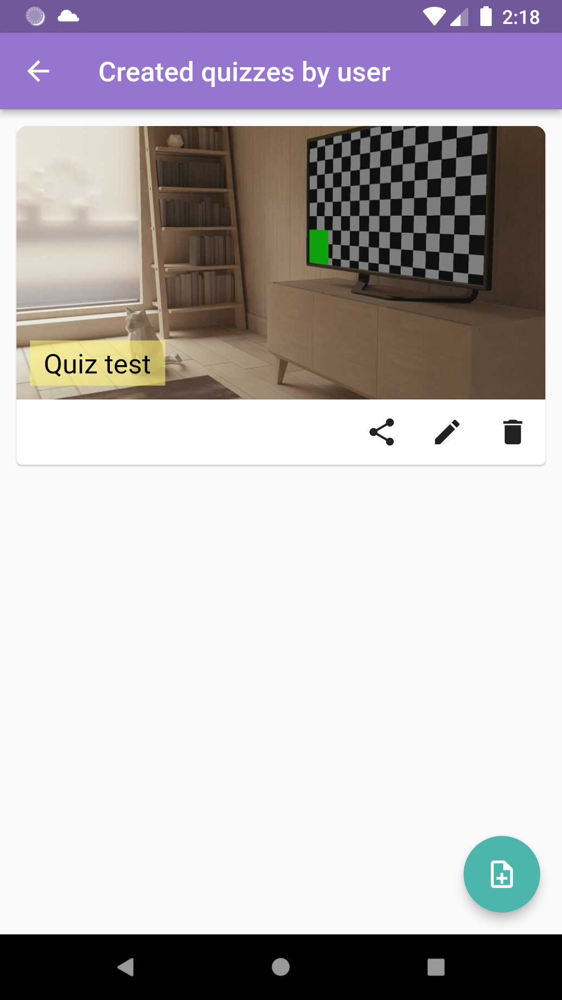 |

| Quiz play games | Quiz play questions screen 1 | Quiz play questions screen 1 | Quiz play results |
| - | - | - | - |
| 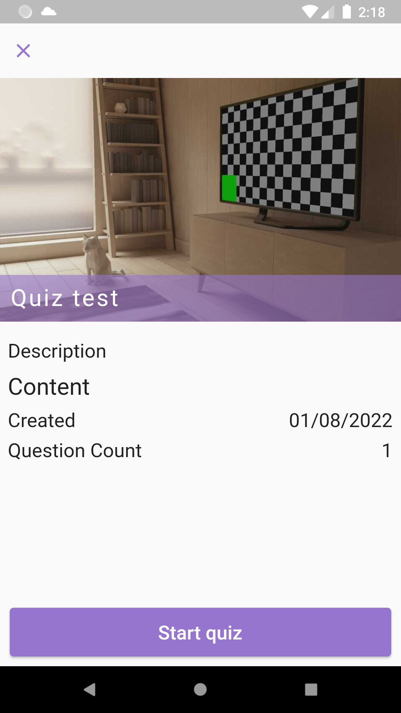 | 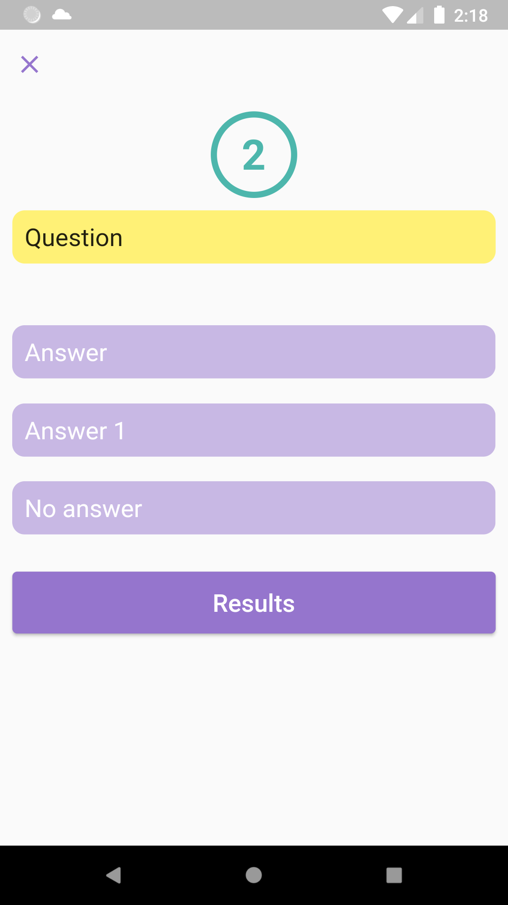 | 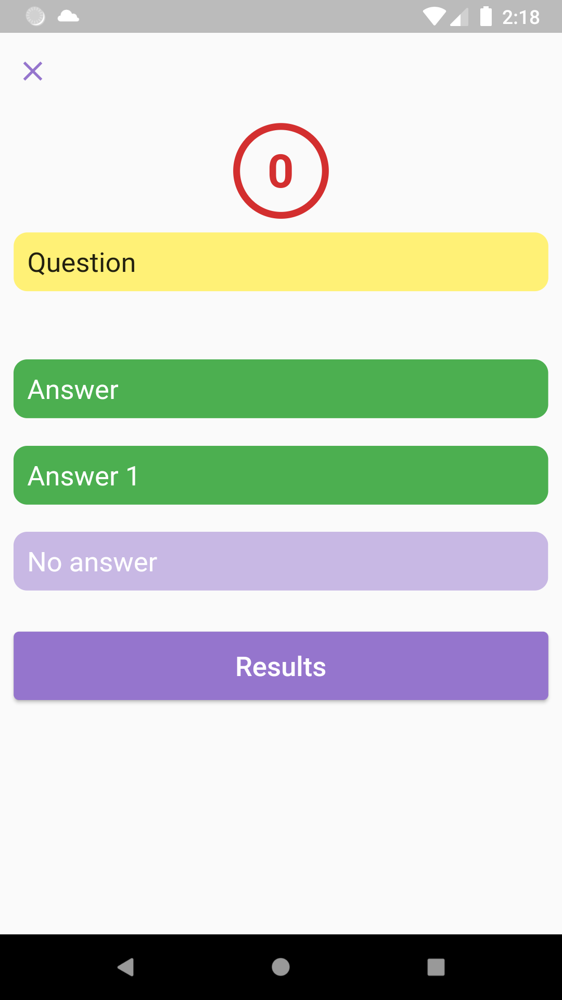 | 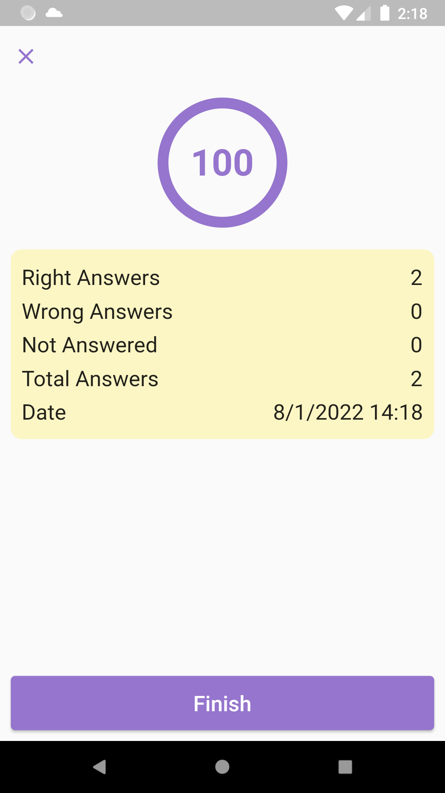 |

## Configuration
I developed app with [flutterfire_cli](https://firebase.flutter.dev/docs/cli)

### Configuration firebase

| Authentication | Cloud Firestore Rules | Storage | 
| - | - | - |
| 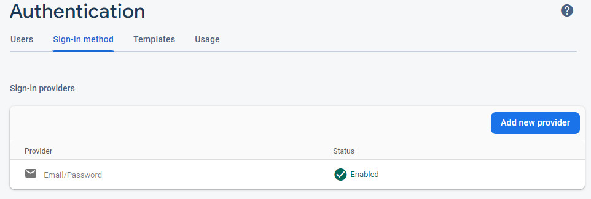 | 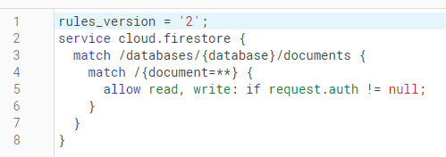 | 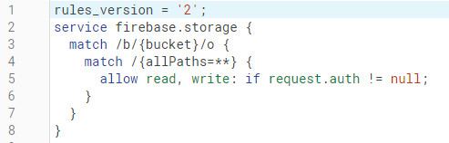 |

| Cloud firestore single field indexes 1 | Cloud firestore single field indexes 1 | 
| - | - |
| 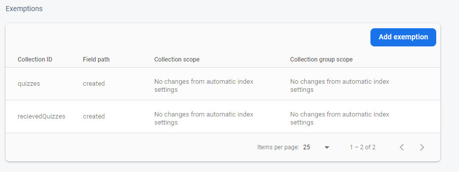 | 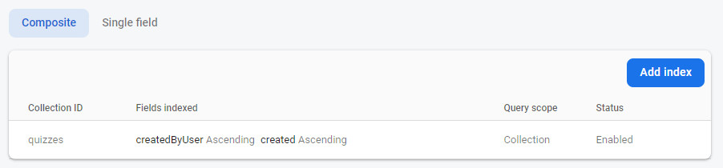 |

## Author
Danil Shubin, 2022

## License
MIT

